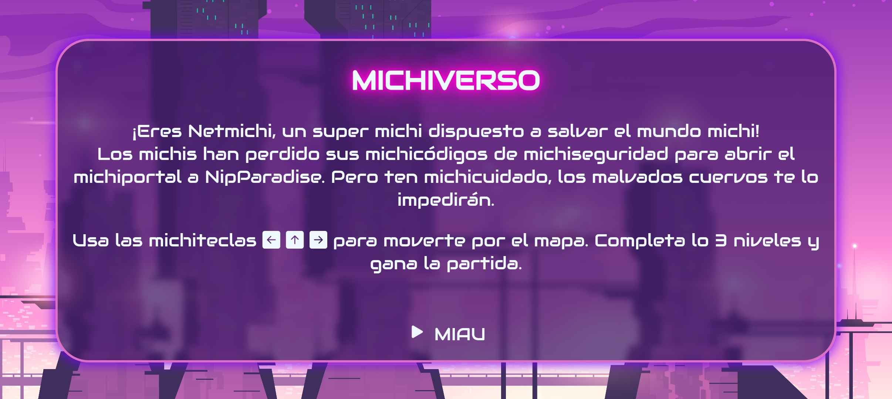
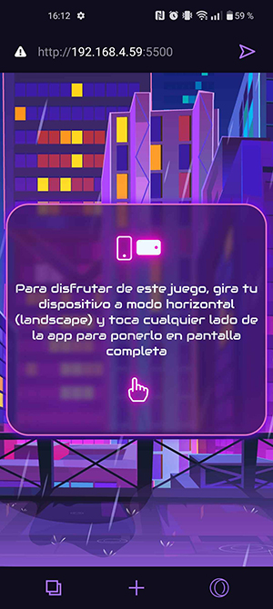
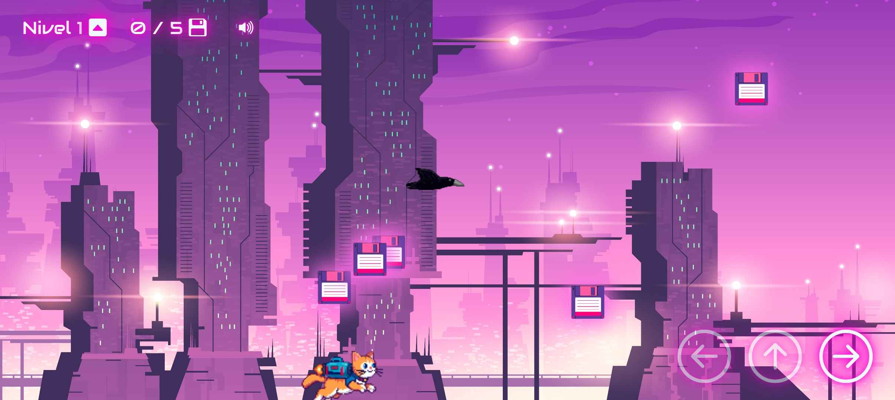
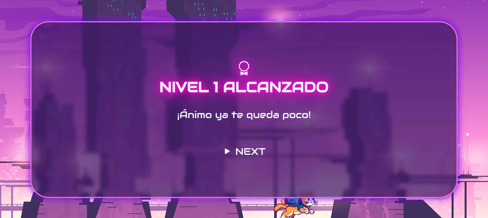
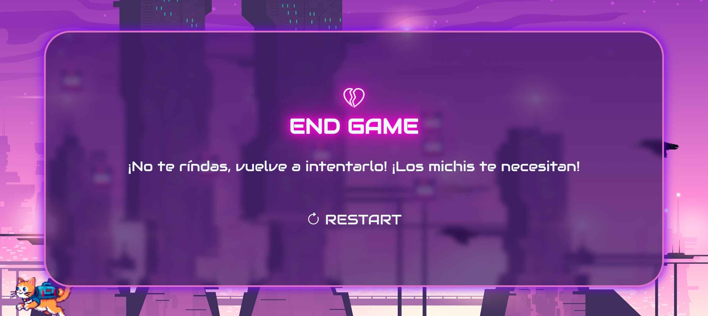
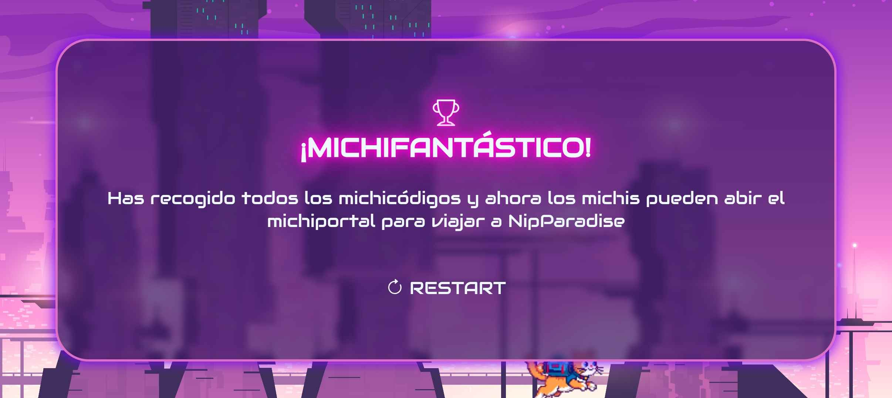

# 😺 MICHIVERSO 😸



¡Eres Netmichi, un super michi dispuesto a salvar el mundo michi!

Los michis han perdido sus michicódigos de michiseguridad para
abrir el michiportal a NipParadise. Pero ten michicuidado, los
malvados cuervos te lo impedirán.

## Objetivo 🎯

Recoge todos los **michicódigos** a lo largo de **tres niveles** para ganar la partida. **Evita a los cuervos**, te impedirán que colecciones todos.

## Cómo Jugar 🕹️

### Si estás en móvil o tablet 📲
- Si estás en móvil o tablet ponlo en horizontal y toca la pantalla para ponerlo Fullscreen.



1. Muevete horizontalmente con ← →  .
2. Salta pulsando ↑ , pulsalo otra vez mientras caes para un doble salto.
3. Colecciona todos los floppys que contienen los michicódigos.
4. Evita a los cuervos para no perder la partida.

## Tecnologías Utilizadas🛠️


## Objetivos 🚀

- Crear una página de descripción del juego (html y css estético)
- Un personaje controlable con teclado o clics.
- Generación aleatoria de monedas dentro del escenario.
- Colisiones entre el personaje y las monedas.
- Sistema de puntuación que aumenta al recoger monedas.

- Hacer responsive el juego
- Averiguar cómo poner una barrera para que el personaje no se salga del espacio de juego
- Agregar sonidos y animaciones
- Agregarle principios de herencia y polimorfismo
### Propios

## Instalación ⚙️

1. Clona este repositorio:
```bash
git clone https://github.com/Algol95/juego-POO.git
```
2. Abre el archivo index.html o con Live Server en tu navegador.
3. ¡Disfruta del juego!

## 🎨 Vista Previa



